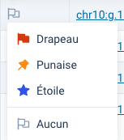

# Variants d'une prescription

L’onglet **Variants** d’une prescription permet la consultation des variants génétiques SNV et CNV détectés lors du séquençage d’une requête.

L'utilisation du [gestionnaire de filtres](/fr/qlin_genetic/_filter_manager/filter_manager.md) et du [panneau latéral de filtres](/fr/qlin_genetic/filter_panel/filter_panel.md) facilite la visualisation des variants dans les [tableaux](/fr/qlin_genetic/tables/tables.md).

## Requêtes

La zone combinée située dans l’entête de l’onglet **Variants** permet de choisir la requête pour laquelle les variants sont affichés.

## Variants génétiques SNV ou CNV

Les boutons situés dans l’entête de l’onglet **Variants**, à droite de la zone combinée, modifient la vue entre les variants génétiques de type SNV ou CNV.

## Informations détaillées sur l'occurrence du variant

Le **+** sur chaque ligne du tableau permet l'affichage d'un panneau imbriqué avec les informations détaillées de l'occurrence du variant pour la requête de séquençage.

Le bouton **Ouvrir IGV** affiche les fichiers de séquençage positionnés sur le variant dans l'[Integrative Genomics Viewer](https://igv.org/).

## Drapeaux

Les drapeaux permettent de mettre un signet sur les variants génétiques d’intérêt d'une requête afin d’y revenir plus tard. Les drapeaux sont accessibles à tous les généticiens du même laboratoire.

Il y a trois types différents de drapeaux :

- Drapeau
- Punaise
- Étoile

### Ajouter et supprimer un drapeau

Cliquez sur la cellule sous la colonne des drapeaux, sur la ligne du tableau correspondant au variant souhaité, et sélectionnez le drapeau dans le menu déroulant affiché.

Il est possible d'indiquer de zéro à trois drapeaux différents par variant.

### Retirer tous les drapeaux

Cliquez sur la cellule sous la colonne des drapeaux, sur la ligne du tableau correspondant au variant souhaité, et sélectionnez **Aucun**.

### Filtrer par drapeaux

L'icône  située dans l'entête de la colonne des drapeaux permet de filtrer le tableau en fonction d'un type de drapeau.

### Dernière mise à jour du drapeau

L'infobulle affichée sur une cellule sous la colonne des drapeaux indique le moment ainsi que l'utilisateur ayant effectué la dernière mise à jour des drapeaux pour ce variant.
