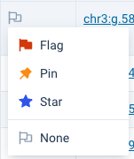

# **Prescription Variants**

The **Variants** tab of a prescription allows for the consultation of SNV and CNV genetic variants detected during the sequencing of a request.

The use of the [Filter Manager](/qlin_genetic/_filter_manager/filter_manager.md) and the [Filter Sidebar](/qlin_genetic/filter_panel/filter_panel.md) facilitates the visualization of variants in the [tables](/qlin_genetic/tables/tables.md).

## Request

The combo box located in the header of the **Variants** tab allows you to choose the request for which the variants are displayed.

## SNV or CNV Genetic Variants

The buttons located in the header of the **Variants** tab, to the right of the combo box, switch the view between SNV and CNV genetic variants.

## Detailed Information on the Occurrence of the Variant

The **+** on each row of the table allows the display of an embedded panel with detailed information on the occurrence of the variant for the sequencing request.

The **Open IGV** button displays the sequencing files positioned on the variant in the [Integrative Genomics Viewer](https://igv.org/).

## Flags

Flags allow you to bookmark genetic variants of interest in a request so you can return to them later. The flags are accessible to all geneticists in the same laboratory.

There are three different types of flags:

- Flag
- Pin
- Star

### Adding and Removing a Flag

Click on the cell under the flags column, on the row of the table corresponding to the desired variant, and select the flag from the displayed dropdown menu.

It is possible to set from zero to three different flags per variant.

### Remove All Flags

Click on the cell under the flags column, on the row of the table corresponding to the desired variant, and select **None**.

### Filter by Flags

The  icon located in the header of the flags column allows you to filter the variants table based on a type of flag.

### Last Flag Update

The tooltip displayed on a cell under the flags column indicates the time and the user who last updated the flags for this variant.
s
