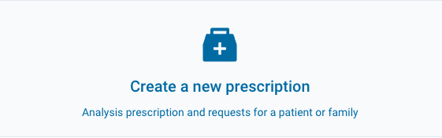

# Create a New Prescription

To create a new analysis and request prescription for a patient or family, click the ‘Create a New Prescription’ button on the homepage.

## Analysis Selection

Use the combo box to select the condition and gene panel to be analyzed. The clinical signs, family members, and prescribed analysis will depend on the selected condition.

## (1) Patient Identification

Once the prescribing institution is selected, entering the medical record number (MRN) and/or RAMQ number is necessary to identify the patient. If the patient already exists in Qlin, their information will be displayed and editable. Otherwise, identification information must be entered before proceeding to the next step of the form.

Identification information for a fetus or newborn can be entered in the ‘Additional Information’ section if needed.

## (2) Clinical Signs

This section is used to document the patient's **observed** and **non-observed** clinical signs using HPO terms. At least one observed clinical sign is required to proceed to the next step.

**OBSERVED clinical signs**

Two sub-sections are available:

- **Suggestions for this analysis**: a list of clinical signs preconfigured based on the selected analysis. Check the ones that are observed.
- **Selected from the HPO tree**: if the observed sign is not part of the suggestions, click **“Browse HPO tree”** to open the search window. You can search for a term by name or HPO code, or navigate the tree, and then check the desired signs.

For each observed sign checked, then select its **age of onset** in the dropdown list that appears.

**NON-OBSERVED clinical signs (optional)**

Click **“Add NON-OBSERVED signs”** to open the same search window and select the signs relevant to the analysis.

**General clinical comment (optional)**

A free-text field is available to add any clinical comment relevant to the analysis.

## (3) Paraclinical Examinations

A list of paraclinical examinations related to the condition and gene panel to be analyzed is provided. Indicate if the examination has been performed using the “Abnormal” or “Normal” radio buttons. If the examination is abnormal, a choice of result is offered, specifically based on the examination.

If needed, you can add other paraclinical examinations in the fields provided.

## (4) History and Diagnostic Hypothesis

Once the “Report Relevant Health Conditions” box is checked, it is possible to enter one or more health conditions and specify a parental link for each.

Indicate the presence of consanguinity and the patient’s ethnicity.

Write the diagnostic hypothesis in the free text field provided. Entering a diagnostic hypothesis is mandatory to submit a prescription.

## (5) Submit

Review the prescription and add a general comment if necessary before submitting it.